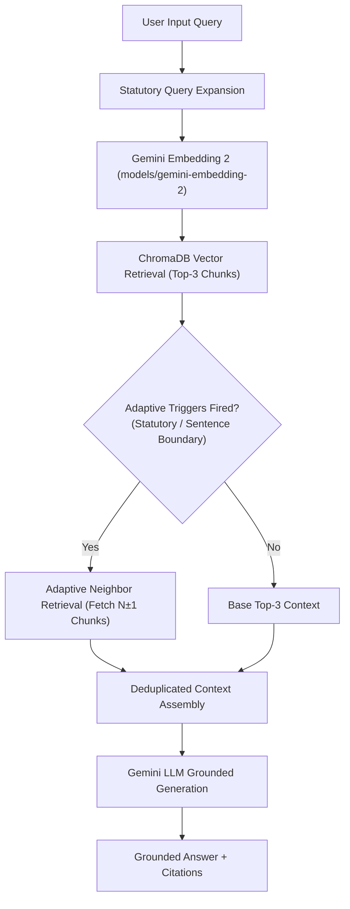

# Bridge AI — Grounded Career & Employment Guidance RAG System

**Bridge AI (Amani)** is an enterprise-grade Retrieval-Augmented Generation (RAG) system built to provide grounded, legally compliant employment rights and career development guidance tailored to young Kenyan university/college students and early-career graduates—with a special focus on empowering first-generation graduates navigating formal employment without corporate family networks.

By combining **Gemini Embedding 2**, **Statutory Query Expansion**, **ChromaDB Dual-Index Retrieval**, **Adaptive Local-Context Neighbor Retrieval ($N \pm 1$)**, and a **Two-Stage Legal Boundary Auditor**, Bridge AI guarantees high evidence recall and complete statutory grounding without hallucinating legal advice or inflating prompt context payloads.

---

## 🎯 Target User & Problem Framing

- **Target Population:** All young Kenyan university and college students, recent graduates, and early-career job seekers.
- **First-Generation Impact:** Especially critical for first-generation higher-education graduates. While their families are proud, their parents and elders excel in informal trade (*Jua Kali*) or agriculture, and cannot guide them through corporate HR policies, probation laws, salary deductions (PAYE, SHA 2.75%, NSSF), or corporate workplace norms.
- **The Vocabulary Disconnect:** Users query in informal, colloquial language (*"Can my boss dock my pay for being late?"*), whereas authoritative answers exist in formal legislation (*"Unlawful salary deductions under Section 19 of the Employment Act, Cap. 226"*).
- **Scam Protection:** Early-career job seekers desperate for their first break are heavily targeted by recruitment fraud schemes demanding upfront M-Pesa deposits (uniform fees, interview registration, medical kit deposits).

---

## 🚀 Key Features & Highlights

- **Statutory & Employment Legal Intelligence:** Grounded on authentic Kenyan statutory documents including the **Employment Act (Cap. 226)**, official **Minimum Wage Schedules**, **HELB Compliance Regulations**, and **NEA Career Placement Protocols**.
- **Multi-Stage Evaluated RAG Architecture:** Benchmarked across 29 ground-truth evaluation queries (66 required facts) and 44 multi-turn LLM-as-a-Judge cases: **Fact Recall**, **Complete Answer Rate**, **Precision@3**, **MRR**, **Grounding (1.91/2.00)**, and **P95 Retrieval Latency (536.6 ms)**.
- **Adaptive Neighbor Retrieval ($N \pm 1$):** Automatically expands top-ranked vector hits with adjacent paragraph chunks from the same source document when statutory or sentence-boundary triggers fire, increasing **Complete Answer Rate by +50.0% (13.8% $\rightarrow$ 20.7%)** and **Fact Recall by +45.7% (0.2644 $\rightarrow$ 0.3851)** at `0.101 ms` in-memory latency.
- **Prompt Engineering Control System:** 4-layer control mechanism incorporating persona rules (explicitly banning robotic templates like *"I understand how you feel"*), a Zero-Assumption Policy, dynamic intent prompt assembly, and an output-side Legal Boundary Auditor.
- **Empirically Proven Pipeline Selection:** Every architectural decision—from embedding models (`gemini-embedding-2`, +52.9% MRR gain) and chunking (`1,500/200`, +31.2% Fact Recall gain) to rejecting global BM25 RRF fusion—is backed by empirical benchmark evidence.
- **Voice Lounge & Web Interface:** Includes a modern React/Vite conversational interface (Amani AI Mentor) with real-time text-to-speech audio feedback and WebAudio streaming.

---

## 🏗️ Production Retrieval Architecture



---

## 📊 Core Empirical Benchmark Summary

Benchmark results across the 29-query evaluation dataset (66 required facts):

| Metric | Dense Baseline | Dense + Query Expansion | Global BM25 RRF (Rejected) | Adaptive N±1 (Production) | Global Top-10 |
| :--- | :---: | :---: | :---: | :---: | :---: |
| **Fact Recall@3** | 0.2414 | 0.2644 | 0.2529 | 🟢 **0.3851** | 0.4483 |
| **Complete Answer Rate@3** | 0.1034 | 0.1379 | 0.1034 | 🟢 **0.2069** | 0.2759 |
| **Precision@3** | 0.5517 | 0.6322 | 0.6552 | 🟢 **0.6437** | 0.6092 |
| **MRR (Mean Reciprocal Rank)** | 0.6592 | 0.7126 | 0.7397 | 🟢 **0.7492** | 0.7311 |
| **Avg Context Tokens** | 1,093 tokens | 1,093 tokens | 1,113 tokens | **2,425 tokens** | 3,633 tokens |
| **P95 Retrieval Latency** | 585.9 ms | 585.9 ms | 701.4 ms | 🟢 **536.6 ms** | 597.4 ms |

---

## 📁 Knowledge Corpus Overview (9 Production Documents)

The production index is built from 9 curated Kenyan employment and career documents:
1. `Employment Act.pdf` — Statutory labor laws, probation, leave, termination rules (Cap. 226).
2. `kenya_minimum_wage_gazette_guide.md` — Authoritative minimum wage schedules for Nairobi & general workers.
3. `helb_repayment_compliance_guide.md` — HELB loan repayment, 1-year grace period, Paybill `200800`, penalties.
4. `bridge_ai_career_handbook_expanded.md` — Contract rights, overtime rates (2.0x public holidays), workplace disputes.
5. `first_salary_financial_literacy.md` — Statutory payslip tax deductions (PAYE, NSSF, SHA 2.75%).
6. `hidden_curriculum_kenya.md` — Practical workplace norms, email etiquette, dress codes (banks vs startups).
7. `job_scam_red_flags.md` — Recruitment fraud detection, upfront M-Pesa fee scams, suspicious job offers.
8. `nea_career_services_guide.md` — National Employment Authority job portal and youth placement services.
9. `BrighterMonday_Job_Search_Advice_RAG_Corpus.pdf` — CV writing, interview preparation, salary negotiation.

---

## 📁 Repository Structure

```text
BridgeAI/
├── corpus/                               # 9 Production Knowledge Corpus Documents
├── src/
│   ├── llm_provider/                     # Gemini Provider & Embedding Integration
│   └── retrieval/                        # Production Retrieval Engine & Adaptive Neighbor Retriever
│       ├── retrieval.py                  # Multi-Index Vector Search & Feature Flag Integration
│       ├── bm25_retriever.py             # Pure Python BM25 Okapi Sparse Retriever
│       └── hybrid_retriever.py           # Reciprocal Rank Fusion (RRF k=60)
├── evaluation/                           # Controlled Evaluation Harnesses & Benchmarks
│   ├── retrieval_eval_set.json           # 29 Evaluation Questions (66 Required Facts)
│   ├── retrieval_metrics.py              # Recall, Precision, MRR Calculation
│   ├── chunk_quality_analyzer.py         # Fact Containment & Complete Answer Evaluator
│   ├── adaptive_neighbor_retriever.py    # Deterministic Adaptive Trigger Engine
│   ├── run_final_controlled_benchmark.py # End-to-End Controlled RAG Benchmark
│   ├── run_bm25_hybrid_experiments.py    # BM25 & RRF Hybrid Evaluation Harness
│   ├── analyze_complete_answer_failures.py # Fact-Level Diagnostic Failure Analyzer
│   ├── run_neighbor_retrieval_experiment.py # Always N±1 Neighbor Experiment
│   └── run_adaptive_neighbor_experiment.py # Adaptive N±1 Neighbor Benchmark
├── docs/                                 # Complete Technical Architecture & Evaluation Docs
│   ├── ARCHITECTURE.md                   # System Design & Sequence Diagrams
│   ├── RETRIEVAL_EVALUATION.md           # Step-by-Step Experimental Journey
│   ├── DECISION_LOG.md                   # Engineering Decision Records (ADRs)
│   ├── CORPUS.md                         # Corpus Gap Analysis & Coverage Audit
│   ├── EVALUATION.md                     # Evaluation Methodology & Metrics Guide
│   ├── INTERVIEW_DEFENSE.md              # 20 Technical Interview Defense Questions
│   ├── LIMITATIONS.md                    # Honesty & Known System Trade-offs
│   ├── PROJECT_EVOLUTION.md              # End-to-End Engineering Case Study
│   └── DOCUMENTATION_AUDIT.md            # Final Documentation Audit Verification
├── bridge_ai_ui/                         # Voice UI & Web Front-End Application
├── main.py                               # FastAPI Production Server Entry Point
└── requirements.txt                      # Python Dependencies
```

---

## 🛠️ How to Run the Project & Evaluation

### Prerequisites
- Python 3.10+
- WSL2 (Ubuntu) recommended on Windows
- Gemini API Key set in `.env` (`GEMINI_API_KEY=your_key`)

### 1. Set Up Environment
```bash
python3 -m venv venv
source venv/bin/activate
pip install -r requirements.txt
```

### 2. Run Retrieval Engine Validation
```bash
python3 src/retrieval/retrieval.py
```

### 3. Run Controlled Benchmarks
```bash
# Run Full Controlled Benchmark Across Evaluation Set
python3 evaluation/run_final_controlled_benchmark.py

# Run Adaptive Neighbor Retrieval Benchmark
python3 evaluation/run_adaptive_neighbor_experiment.py
```

### 4. Start Production Server & Web UI
```bash
# Terminal 1: Backend Server
bash start_backend.sh

# Terminal 2: Web UI
cd bridge_ai_ui && npm run dev
```

---

## ⚠️ Known Limitations & Future Work

- **Multi-Document Evidence Aggregation:** Queries requiring facts distributed across distinct source files require multi-query retrieval or document-level routing.
- **Corpus Freshness:** Statutory minimum wage rates and statutory tax schedules (e.g. SHA 2.75%) require periodic gazette notice updates.
- **Future Work:** Implement document-level pre-routing for broad career queries and integrate automated gazette document ingestion pipelines.

---

## 📜 License & Compliance

Built for educational and technical portfolio demonstration purposes. Legal references are derived from public Kenyan statutory publications (Employment Act Cap. 226).
