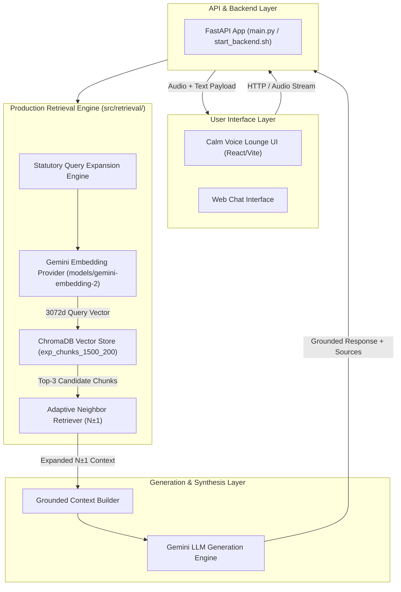
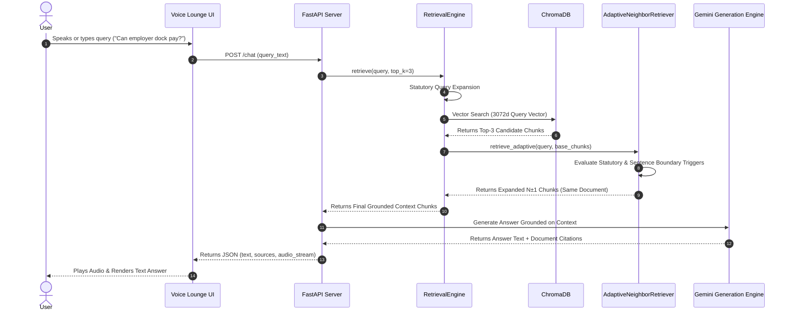

# Bridge AI — System Architecture & Component Design

This document details the complete end-to-end architecture of **Bridge AI**, explaining the component layers, sequence flows, data structures, and empirical trade-offs that govern the production system.

---

## 1. High-Level System Architecture

Bridge AI implements a **Multi-Stage RAG Pipeline** designed for high precision, complete statutory fact containment, and sub-second end-to-end response latency.



---

## 2. Component Deep Dive: Design, Alternatives & Empirical Evidence

### Component 1: Statutory Query Expansion
- **WHAT it does:** Pre-processes user queries by detecting statutory or legal intent and appending domain-specific statutory terminology (e.g. *"dock pay"* $\rightarrow$ *"dock pay unlawful salary deduction Section 19 penalty"*).
- **WHY it exists:** Resolves vocabulary mismatch where colloquial queries (*"can boss deduct money for being late?"*) fail to match formal legal terminology (*"unauthorized salary deduction Section 19"*).
- **ALTERNATIVES considered:**
  - *No Expansion (Raw Query Vector Search):* Missed statutory queries.
  - *LLM-Based Query Expansion:* Added +350-500ms latency per turn.
- **EVIDENCE for selection:** Increased **MRR from 0.6592 $\rightarrow$ 0.7126** (+8.1% gain) with **`<0.01ms` latency overhead**.

---

### Component 2: Gemini Embedding 2 (`models/gemini-embedding-2`)
- **WHAT it does:** Projects statutory text chunks and query strings into a 3072-dimensional normalized cosine vector space.
- **WHY it exists:** Generates dense semantic representations capable of capturing legal semantics and complex sentence structures.
- **ALTERNATIVES considered:**
  - *`text-embedding-004` (768d):* Achieved MRR = 0.5862.
- **EVIDENCE for selection:** Empirical benchmark demonstrated `gemini-embedding-2` won with **MRR = 0.6592** vs `text-embedding-004` (MRR = 0.5862), delivering a **+12.5% relative retrieval quality gain**.

---

### Component 3: ChromaDB Vector Store & 1,500/200 Chunking
- **WHAT it does:** Stores 248 indexed corpus chunks split at 1,500 characters with 200 character overlap (`exp_chunks_1500_200`).
- **WHY it exists:** 1,500 characters (~375 tokens) provides sufficient context length to preserve complete statutory sections (e.g., Section 42 probation rules) without fragmenting legal clauses.
- **ALTERNATIVES considered:**
  - *500 / 50 overlap:* Fact Recall@3 = 0.1609 (Severely fragmented context).
  - *1,000 / 150 overlap:* Fact Recall@3 = 0.2184.
  - *1,500 / 200 overlap:* Fact Recall@3 = 0.2414.
- **EVIDENCE for selection:** `1,500 / 200` won the chunk quality sweep with highest **Fact Recall@3 (0.2414)** and highest **Precision@3 (0.5517)**.

---

### Component 4: Adaptive Neighbor Retrieval ($N \pm 1$)
- **WHAT it does:** Evaluates deterministic statutory and sentence-boundary triggers on top-3 vector hits. If a trigger fires, it retrieves adjacent chunks ($N-1$ and $N+1$) **strictly within the same source document**.
- **WHY it exists:** Solves chunk-boundary splitting where legal definitions span adjacent paragraphs without forcing global Top-10 vector search.
- **ALTERNATIVES considered:**
  - *Global Top-10 Search:* Achieved Complete Answer Rate = 27.6%, but inflated prompt context to 3,633 tokens per turn.
  - *Global BM25 RRF Fusion:* Reduced Complete Answer Rate from 0.1379 $\rightarrow$ 0.01034 due to keyword density pollution.
  - *Always N±1:* Increased context payload by +1,345 tokens unconditionally.
- **EVIDENCE for selection:** Adaptive N±1 increased **Complete Answer Rate from 13.8% $\rightarrow$ 20.7%** and **Fact Recall from 0.2644 $\rightarrow$ 0.3851** while adding **`<0.1ms` neighbor lookup latency**.

---

## 3. End-to-End Execution Sequence



---

## 4. Chunk Metadata Schema

Every chunk stored in ChromaDB adheres to the following metadata structure:

```json
{
  "id": "Employment Act.pdf_c12_s1500",
  "document": "...Full text of chunk...",
  "metadata": {
    "source": "Employment Act.pdf",
    "title": "Employment Act (Cap. 226)",
    "chunk_index": 12,
    "chunk_size": 1500,
    "overlap": 200,
    "char_length": 1498,
    "est_tokens": 374,
    "start_line": 240,
    "end_line": 285
  }
}
```

This strict schema allows `AdaptiveNeighborRetriever` to perform **zero-overhead in-memory neighbor lookups** using pre-computed chunk index keys (`source` + `chunk_index + 1`).
