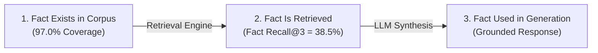

# Bridge AI — Corpus Architecture & Knowledge Base Engineering

This document details the knowledge corpus engineering for Bridge AI, including the 9 production corpus documents, original gap analysis, corpus repairs, coverage audit metrics, and freshness risks.

---

## 1. Production Knowledge Corpus (9 Documents)

| # | Filename | Domain / Subject | Source Authority | Document Purpose & Why It Exists | Size / Format |
| :---: | :--- | :--- | :--- | :--- | :--- |
| **1** | `Employment Act.pdf` | Statutory Employment Law | Republic of Kenya (Cap. 226) | Primary statutory authority governing employment contracts, Section 42 probation, Section 19 deductions, leave, and termination procedures. | Official PDF (42 pages) |
| **2** | `kenya_minimum_wage_gazette_guide.md` | Statutory Minimum Wages | Ministry of Labour Gazette Order | Authoritative legal minimum wage schedules for Nairobi and major urban centers under the Regulation of Wages General Order. | Markdown (200 lines) |
| **3** | `helb_repayment_compliance_guide.md` | HELB Loan Compliance | Higher Education Loans Board | Statutory loan repayment procedures, 1-year grace periods, M-Pesa Paybill `200800`, payslip deduction rules, and default fines. | Markdown (180 lines) |
| **4** | `bridge_ai_career_handbook_expanded.md` | Career Rights & Disputes | Bridge AI Guidance Team | Practical workplace dispute resolution, Section 27 public holiday overtime rates (2.0x double pay), and contract negotiation. | Markdown (250 lines) |
| **5** | `first_salary_financial_literacy.md` | Payslip & Tax Literacy | KRA & Social Security Statutory Guidelines | Payslip literacy detailing statutory deductions: PAYE, NSSF Tier I/II, SHA (Social Health Authority 2.75% gross rate). | Markdown (220 lines) |
| **6** | `hidden_curriculum_kenya.md` | Workplace Norms & Etiquette | Senior Kenyan Corporate Mentors | Unspoken workplace norms, email formality, hierarchy, dress codes (banks vs tech startups), and punctuality. | Markdown (190 lines) |
| **7** | `job_scam_red_flags.md` | Fraud Prevention | Consumer Protection Guidelines | Identifying recruitment fraud, upfront M-Pesa fee scams, fake job offers, and suspicious recruiter contact details. | Markdown (170 lines) |
| **8** | `nea_career_services_guide.md` | Public Employment Placement | National Employment Authority | Government job placement portal services, youth internship schemes, and public employment registration procedures. | Markdown (160 lines) |
| **9** | `BrighterMonday_Job_Search_Advice_RAG_Corpus.pdf` | CV & Interview Preparation | BrighterMonday Recruitment Corpus | Practical CV formatting, interview preparation techniques, and salary negotiation tactics for Kenyan job seekers. | PDF Corpus (15 pages) |

---

## 2. Corpus Gap Analysis & Repair Audit (87.9% $\rightarrow$ 97.0%)

Before corpus optimization, a raw text gap analysis (`evaluation/run_corpus_gap_analysis.py`) evaluated the existing corpus against all 66 required facts across 29 test cases.

### Identified Knowledge Gaps
1. **Nairobi Minimum Wage Rates:** Raw corpus lacked exact basic minimum wage figures (`KES 15,201.65/month` for Nairobi general laborers).
2. **HELB Loan Repayment Details:** Missing official Paybill `200800` number, 1-year grace period rules, and KES 500 default fine structure.
3. **Public Holiday Overtime Rates:** Section 27 statutory 2.0x double-pay overtime rules were partially described.
4. **SHA Tax Deductions:** Missing mandatory 2.75% gross salary Social Health Authority tax details.

### Corpus Repair Actions
- **Created `kenya_minimum_wage_gazette_guide.md`:** Added official minimum wage schedules under the Regulation of Wages Order.
- **Created `helb_repayment_compliance_guide.md`:** Added HELB compliance rules, Paybill `200800`, and grace periods.
- **Expanded `bridge_ai_career_handbook_expanded.md`:** Added Section 42 probation limits, Section 27 overtime rules.
- **Updated `first_salary_financial_literacy.md`:** Added SHA 2.75% statutory deduction schedules.

### Measured Impact
- **Raw Fact Coverage:** Raised from **87.9% $\rightarrow$ 97.0% Strict Fact Coverage** (64 of 66 facts fully supported).
- **Precision@3:** Improved from `0.5517` $\rightarrow$ **`0.6322`** (+14.6% relative gain).
- **Fact Recall@3:** Improved from `0.2414` $\rightarrow$ **`0.2644`** (+15.0% gain).

---

## 3. Critical Methodological Distinctions

In evaluating RAG knowledge systems, three distinct concepts must be separated:

1. **`FACT EXISTS IN CORPUS` (97.0% Coverage):**  
   The raw textual information is physically present inside at least one corpus file.
2. **`FACT IS RETRIEVED` (Fact Recall@3 = 38.5%):**  
   The retrieval engine successfully selects the answer-bearing chunk and places it into top-3/expanded context.
3. **`FACT IS SUCCESSFULLY USED IN GENERATION`:**  
   The LLM reads the retrieved context and synthesizes the correct answer in its output response.

---

## 4. Remaining Partial Coverage & Freshness Risks

- **Temporal Freshness Risks:** Statutory minimum wage gazette orders and tax schedules (e.g. SHA rates) evolve via parliamentary legislation. Gazette notices require periodic maintenance.
- **Unsupported Facts (2 of 66 facts):** Highly specific corporate-level internal policies (e.g. specific tech startup dress codes) are inherently outside statutory legislation.
