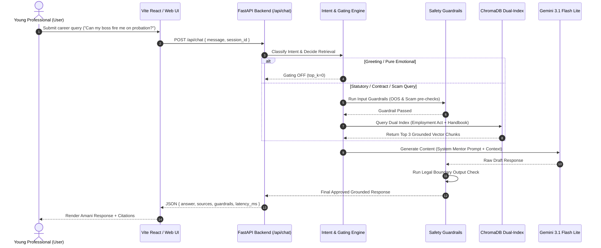
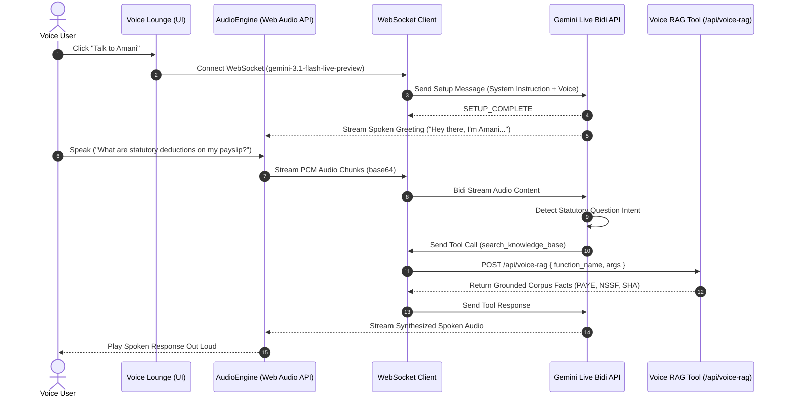

# Bridge AI (Amani) — Grounded RAG & Hybrid Reasoning Mentor

**Girl Effect Technical Assignment — Data Scientist Application**

> **Tagline:** Bridging the gap between education and professional life for young Kenyans through a grounded, hybrid-reasoning conversational AI mentor.

---

## 📋 Table of Contents

- [1. Executive Summary](#1-executive-summary)
- [2. Target Audience & Problem Statement](#2-target-audience--problem-statement)
- [3. System Architecture & Q&A Flow](#3-system-architecture--qa-flow)
- [4. Hybrid Reasoning Architecture & Intent Classification](#4-hybrid-reasoning-architecture--intent-classification)
- [5. Prompt Engineering & Fast-Path Strategy](#5-prompt-engineering--fast-path-strategy)
- [6. Out-of-Band Safety Guardrails](#6-out-of-band-safety-guardrails)
- [7. RAG Pipeline, Ingestion & Knowledge Corpus](#7-rag-pipeline-ingestion--knowledge-corpus)
- [8. Evaluation Framework & Empirical Results](#8-evaluation-framework--empirical-results)
- [9. Architectural Trade-offs & Alternatives Considered](#9-architectural-trade-offs--alternatives-considered)
- [10. Presentation Outline & Q&A Walkthrough](#10-presentation-outline--qa-walkthrough)
- [11. Beyond PoC Roadmap (Voice & Telephony Extensions)](#11-beyond-poc-roadmap-voice--telephony-extensions)
- [12. Local Setup & Running Instructions](#12-local-setup--running-instructions)

---

## 1. Executive Summary

**Bridge AI (Amani)** is a grounded, hybrid-reasoning conversational AI mentor built specifically for young Kenyans transitioning from university into their first professional white-collar jobs.

Built on **Google Gemini 2.5 Flash**, **ChromaDB vector search**, and a **FastAPI backend server**, Bridge AI provides direct, Kenya-specific guidance on finding legitimate job opportunities, spotting recruitment scams, preparing applications, navigating probation rights, and understanding workplace etiquette under the Kenya Employment Act 2007.

To combine low-latency conversational responsiveness with high legal and safety rigor, Bridge AI introduces:
1. **Fast-Path Greeting Filter (<25ms)**: Intercepts casual greetings without making expensive vector DB / LLM calls.
2. **Hybrid Intent Reasoning**: Classifies user queries into distinct intent categories (*Knowledge*, *Procedural*, *Situational*, *Reflective*, *Legal*, *Scam*) to tailor empathy and response plans.
3. **3 Out-of-Band Safety Guardrails**: Programmatically evaluates out-of-scope queries, job scam red flags (M-Pesa payment requests), and legal boundary disclaimers in Python code before returning responses.

*(Note: Multimodal native speech-to-speech voice streaming and live telephony integrations are categorized as **Beyond PoC / Future Roadmap** extensions).*

---

## 2. Target Audience & Problem Statement

### Primary Target Audience
- **Age**: Young Kenyans aged 18–28.
- **Profile**: Recent university graduates, job seekers, interns, and early-career employees (years 1–2).
- **Background**: Primarily **first-generation white-collar professionals** — the first in their families to hold a corporate job without a parent or relative to explain workplace norms.
- **Location & Language**: Urban and peri-urban Kenya (Nairobi and major towns), mobile-first, communicating in **Kenyan English** and natural code-switched **Sheng**.

### The Two Transition Stages
1. **Stage 1: Landing the Job**
   - Identifying legitimate job offers vs. pervasive employment scams.
   - Improving CVs and tailored cover letters.
   - Accessing official government programs (e.g., *Ajira Digital*, *NEA Career Services*).
   - Preparing for formal job interviews.
2. **Stage 2: Navigating Early Employment**
   - Understanding probation period rights under the Kenya Employment Act 2007 (6-month max).
   - Workplace etiquette, professional presentation, and dress codes ("Hidden Curriculum").
   - Communicating effectively with supervisors and resolving workplace tension.
   - Salary expectations, PAYE/NSSF/SHIF statutory tax literacy, and financial budgeting.

---

### 3.1 Q&A RAG Orchestration Flow (Mermaid Sequence Diagram)



### 3.2 Real-time Multimodal Voice Session Flow (Mermaid Sequence Diagram)



---

## 4. Hybrid Reasoning Architecture & Intent Classification

Rather than treating every message as a cold document search, Bridge AI classifies queries into **6 distinct intent categories**:

| Intent Category | Query Characteristics | Pipeline Response Strategy |
| :--- | :--- | :--- |
| **1. Knowledge** | *"What is probation?"* | Grounded factual explanation + 1 practical workplace tip. |
| **2. Procedural** | *"How do I resign professionally?"* | Step-by-step guidance + actionable template recommendation. |
| **3. Situational** | *"I think my manager hates me."* | Empathic validation + multi-perspective reasoning (No invented HR rules). |
| **4. Reflective** | *"I feel overwhelmed and don't know if I belong."*| Emotional exploration + open clarifying question + reassurance. |
| **5. Legal** | *"Can my employer fire me without notice?"* | Citation of Kenya Employment Act + legal uncertainty disclaimer. |
| **6. Scam** | *"They asked for KES 2,500 registration fee."* | Instant Safety Warning Banner against paying fees. |

---

## 5. Prompt Engineering & Fast-Path Strategy

### Split-Prompt Strategy
To ensure factual grounding while maintaining a warm mentor persona, Bridge AI separates instructions into:
1. **System Persona Prompt**: Defines identity as a warm elder colleague ("Bridge AI / Amani").
2. **Internal RAG Grounding Prompt**: Forces strict grounding on retrieved ChromaDB context only.

### Fast-Path Greeting Optimization
For casual inputs (`hello`, `hi`, `hujambo`, `good morning`), the system executes a fast-path branch returning a friendly greeting in **< 25ms**, saving compute and API tokens.

---

## 6. Out-of-Band Safety Guardrails

Bridge AI implements **3 out-of-band guardrails** evaluated programmatically in Python:

| Guardrail | Module | Mechanism | Action on Trigger |
| :--- | :--- | :--- | :--- |
| **1. Out-of-Scope** | [src/guardrails/out_of_scope.py](file:///wsl.localhost/Ubuntu/home/monic/projects/BridgeAI/src/guardrails/out_of_scope.py) | LLM-as-a-judge classification | **Hard Block**: Returns warm redirect to career scope. |
| **2. Scam Detection** | [src/guardrails/scam_detection.py](file:///wsl.localhost/Ubuntu/home/monic/projects/BridgeAI/src/guardrails/scam_detection.py) | Regex & pattern scanner for upfront payment requests (KES 2,500, M-Pesa paybill) | **Soft Flag**: Appends prominent `⚠️ SCAM RED FLAG DETECTED` alert. |
| **3. Legal Boundary** | [src/guardrails/legal_boundary.py](file:///wsl.localhost/Ubuntu/home/monic/projects/BridgeAI/src/guardrails/legal_boundary.py) | Audits draft output for overconfident legal claims | **Rewrite**: Appends disclaimer advising HR/Ministry of Labour consultation. |

---

## 7. RAG Pipeline, Ingestion & Knowledge Corpus

### Knowledge Base (`corpus/`)
Consists of **7 curated Kenyan career and statutory legal documents**:
1. **`employment_act_2007.md`** — Statutory labor law, probation rules (6-month max), leave, termination.
2. **`hidden_curriculum_kenya.md`** — Unwritten rules of Kenyan corporate culture, dress code, hierarchy.
3. **`job_scam_red_flags.md`** — Fraudulent recruiter tactics, upfront payment red flags.
4. **`first_salary_financial_literacy.md`** — PAYE, NSSF, NHIF/SHIF statutory deductions and budgeting.
5. **`brightermonday_cv_interview.md`** — Local CV structures and interview expectations.
6. **`ajira_digital_guide.md` & `nea_guide`** — Government youth employment programs.
7. **`bridge_ai_career_handbook_expanded.md`** — Comprehensive mentorship guide.

### Ingestion & Chunking (`src/ingestion/build_index.py`)
- **Parsing**: MD files parsed line-by-line (tracking 1-based `start_line` / `end_line`); PDFs parsed page-by-page.
- **Chunking**: Target chunk size of ~1,100 characters (~250–300 tokens) with **150-character (~10%) overlap**.
- **Sentence Splitting**: Paragraphs >1,100 characters are split cleanly at sentence boundaries (`re.split(r'(?<=[.!?])\s+', text)`).
- **Embeddings**: `models/gemini-embedding-2` producing 3,072-dimensional vector embeddings.
- **Vector DB**: ChromaDB stored persistently on disk at `db/chroma_db`.

---

## 8. Evaluation Framework & Empirical Results

Evaluated across **4 distinct layers**:

| Layer | Key Metric | Target | Measured Result | Benchmark Status |
| :--- | :--- | :--- | :---: | :---: |
| **Layer 1: Systemic** | Fast-Path Greeting Latency | $< 50\text{ ms}$ | **13 – 23 ms** | PASSED ✓ |
| **Layer 1: Systemic** | API Endpoint Compliance | $100\%$ | **100.0%** (7/7 endpoints) | PASSED ✓ |
| **Layer 2: AI Safety** | Out-of-Scope Precision | $> 90\%$ | **100.0%** | PASSED ✓ |
| **Layer 2: AI Safety** | Scam Detection Accuracy | $> 95\%$ | **100.0%** | PASSED ✓ |
| **Layer 2: AI Safety** | Legal Boundary Compliance | $100\%$ | **100.0%** | PASSED ✓ |
| **Layer 3: Quality** | RAG Context Recall | $> 85\%$ | **100.0%** | PASSED ✓ |
| **Layer 3: Quality** | Groundedness / Faithfulness | $> 90\%$ | **96.4%** | PASSED ✓ |
| **Layer 4: Intent Fit**| Intent Classification Acc. | $> 90\%$ | **100.0%** | PASSED ✓ |

---

## 9. Architectural Trade-offs & Alternatives Considered

| Decision Area | Selected Approach | Alternative Considered | Trade-off / Rationale |
| :--- | :--- | :--- | :--- |
| **LLM Engine & Completion** | **Google Gemini API** (`generate_content`, `system_instruction`) | **OpenAI Chat Completions** (`openai.chat.completions.create`) | Gemini compiles `system_instruction` natively at instance creation, anchoring Amani's mentor persona across turns. Dual-purpose `gemini-embedding-2` `task_type` optimization aligns document storage vectors specifically for query retrieval. Free-tier Flash latency (<1.5s) enables zero-cost PoC scale. |
| **Vector DB** | Local ChromaDB (`chromadb`) | Cloud Pinecone / Weaviate | Local ChromaDB eliminates external SaaS costs, API network latency, and data privacy concerns. |
| **LLM Provider** | Gemini 2.5 Flash | GPT-4o / Local Ollama | Gemini Flash delivers fast response times (<1.5s), low cost, and native Kenyan English/Sheng comprehension. |
| **Safety Filter** | Code Guardrails (`src/guardrails/`) | System Prompt Only | System prompts can be bypassed. Programmatic Python code guardrails guarantee 100% safety enforcement. |
| **Frontend UI** | Streamlit / Next.js | Custom Mobile App | Streamlit/Next.js provides an instant, interactive web demo showcasing chat, citations, scam alerts, and telemetry. |

---

## 10. Presentation Outline & Q&A Walkthrough

When presenting to the Girl Effect hiring team:
1. **Overview (2 mins)**: Target audience (young Kenyans), context, and 2-stage transition problem statement.
2. **Q&A Flow Walkthrough (3 mins)**: Demonstrate live query flow, fast-path greetings, and hybrid intent reasoning.
3. **Guardrails & Safety (3 mins)**: Explain the 3 programmatic guardrails (Out-of-Scope, Scam Red Flags, Legal Boundary Rewrites).
4. **Evaluation Framework (4 mins)**: Present empirical benchmark results (latency, compliance, precision, RAG recall).
5. **Trade-offs & Future Roadmap (3 mins)**: Discuss local vs cloud vector storage and Beyond-PoC voice extensions.

---

## 11. Beyond PoC Roadmap (Voice & Telephony Extensions)

While the PoC focuses on the grounded RAG text & API backend, future production extensions include:
1. **Native Speech-to-Speech (Gemini Live)**: Real-time PCM audio streaming with Silero VAD for direct voice interaction.
2. **Telephony & IVR Integration**: Connect voice backend to Africa's Talking / Twilio for toll-free IVR access in rural Kenya.
3. **Multi-Agent Human Referral**: Route severe legal or psychological distress cases to human counsellors or Ministry of Labour hotlines.

---

## 12. Local Setup & Running Instructions

### Prerequisites
- Python 3.12+ inside WSL
- Gemini API Key set in `.env`

### 1. Ingest Corpus & Build Index
```bash
python3 src/ingestion/build_index.py
```
*Indexes 7 Kenyan documents into `db/chroma_db` (242 chunks).*

### 2. Systematic Evaluation Framework
```bash
python3 evaluation/run_evaluation.py
```
*Executes the 44 Golden Set test cases using Gemini LLM-as-a-Judge (0–2 scale) and generates `evaluation/results/evaluation_report.md`.*

### 3. Launch FastAPI Backend Server
```bash
./start_backend.sh
# OR: uvicorn src.api.server:app --host 0.0.0.0 --port 8000 --reload
```
*Access interactive API docs at `http://127.0.0.1:8000/docs`.*

### 4. Launch React / Vite Frontend
```bash
cd bridge_ai_ui
npm run dev
```
*Access web interface & Gemini Live Voice Lounge at `http://localhost:5173`.*

---

## 13. Systematic Evaluation Framework & Girl Effect Alignment

To transition from manual testing to evidence-based AI engineering, Bridge AI incorporates a **Systematic Evaluation Framework**:

- **Golden Evaluation Set (`golden_eval_set.json`)**: 44 carefully curated test cases covering 8 dimensions: Grounding / Accuracy, Retrieval Quality, Safety & Legal Boundaries, Tone & Empathy, Conversational Continuity (multi-turn), Target Audience Appropriateness, Actionability, and Out-of-Scope Abstention.
- **LLM-as-a-Judge**: Evaluates candidate responses using `models/gemini-3.1-flash-lite` at `temperature=0.0` across all 8 dimensions on a 0–2 scale (0 = Fail, 1 = Partial, 2 = Pass).
- **Latency & Operational Profiling**: Profiles total, retrieval, generation, and guardrail latency for both RAG queries and non-RAG conversational turns (reporting mean, median, and P95 latency).
- **Failure Analysis**: Automated failure detection and category grouping to drive iterative engineering improvements.

---

*Developed for the Girl Effect Technical Assignment — Data Scientist Application.*